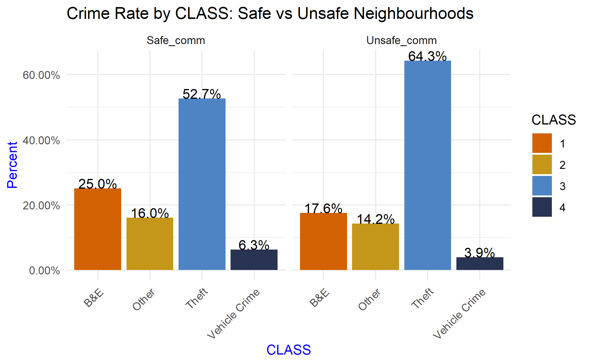
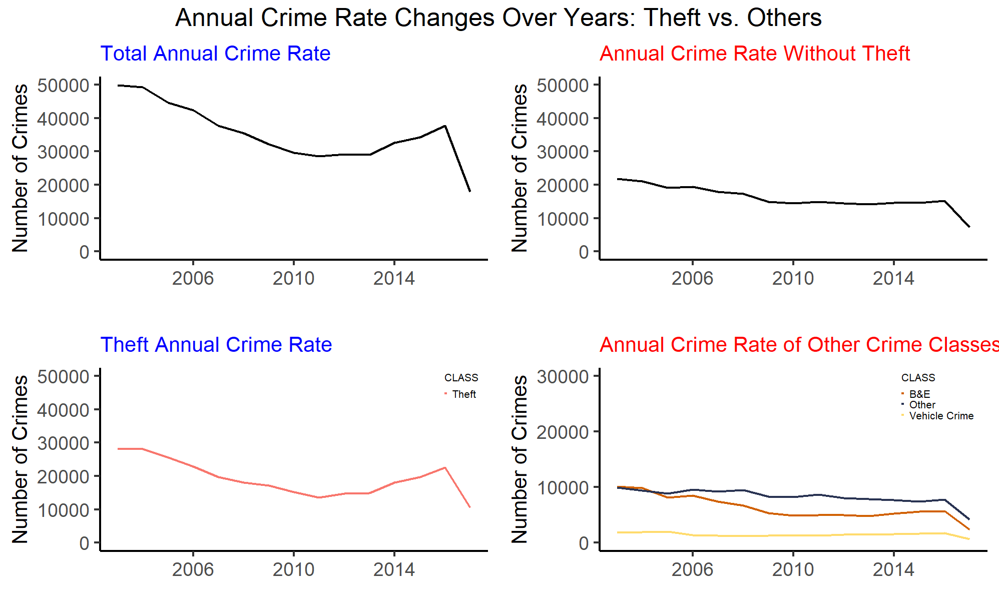

# Crime_Rate_Vancouver_EDA

Detailed EDA done for the crime rate of vancouver between 2003 - 2017

## Data Description

The dataset contains the data for crime rate in Vancouver, BC.
Data source: https://www.kaggle.com/wosaku/crime-in-vancouver

## Data Attributes

TYPE-Crime type
YEAR-Recorded year
MONTH-Recorded month
DAY-Recorded day
HOUR-Recorded hour
MINUTE-Recorded minute
HUNDRED_BLOCK-Recorded block
NEIGHBOURHOOD-Recorded neighborhood
XGPS-longtitude
YGPS-latitude

## Objective

1. To perform univariate and multivariate exploratory analysis of the dataset provided.
2. To provide suggestions for reducing the crime rate in Vancouver
3. To develop an interactive map for the profiles of crime incidents of Vancouver using Power BI

## Major Findings

1. combined neighbourhoods and grouped into two based on total crime number of neighbourhood: Safe community and Unsafe community. 
    Safe community consists of the top eight highest crime rates neighbourhoods and the rest grouped as unsafe community. 
    The graph shows that break and enter type crime is more likely to happen among safe communities as it is 25% out of total crime activities. 
    On the contrary, the percentage of theft crime is 64.3% in unsafe neighbourhoods, 
    and it is significantly higher by 11.6% than the theft crime rate of safe neighbourhoods.
 
    
2. The annual crime rate swings alike the movement of total crime rate over the years. 
    In contrast, the total crime rate trend without theft type crimes steadily decreases over time and a similar tendency is seen in the other types of crimes excluding theft.
    As over 55% of crimes activities is theft classified crime, this is not surprising. 
    The total crime rate drastically declines from 2003 until 2010, but it starts to increase after 2013. 
    The total crime rate is reacting strongly to the theft crime trend, and this tells that theft is the most impactable factor
 

## Conclusion
1. Theft type crimes are the most common type of crimes in Vancouver, and reducing theft crimes must be priortized 
    in order for reducing the overall crime rate of the city     
2. Burglary is relatively common in safer neighbourhoods of Vancouver. Actions to prevent such type of crimes are required
3. Bicycle theft crimes are seasonal sensitive. The number of bicycle theft crimes increases towards summer and declines to winter
4. most of burglary types of crimes recorded on day 1 and day 15. 
    This indicates that burglary crime types are likely to be organized ahead 
5. Break and enter commercial crimes have a different pattern in time. While other types of crimes hit the peak early evening and stays high until 12am,
    Break and enter commercial crimes are high during early morning before 5 am
6. homicide and vehicle collision with fatality do not share trend with other type of crime at any time and place, 
    thus such types of crime happen rather unintentionally.
