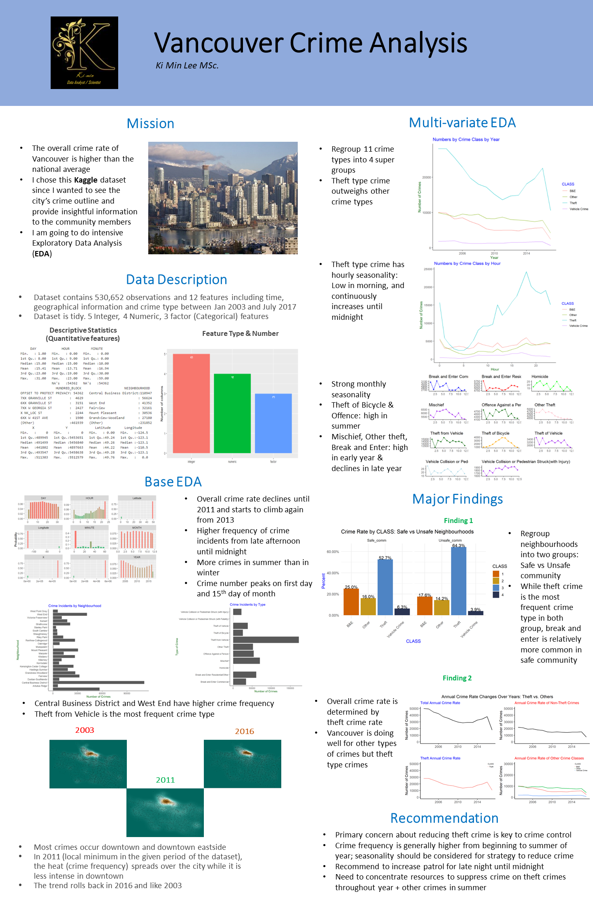

# Crime Rate Vancouver 2003-2017 EDA

Detailed EDA done for the crime rate of vancouver between 2003 - 2017

### Executive Summary

Vancouver has been named one of the most liveable city in the world for many years. However, the overall crime rate in Vancouver is higher than the national average by 26%, and this has become a major concern of Vancouverite. In this project, I have over 16 years of crime reports from across all of Vancouver's neighbourhoods, and I analyze the data to provide insightful information for crime reduction of the city 

### Data Description

The dataset contains crime report data of 530,652 observations and 12 features
Data source: https://www.kaggle.com/wosaku/crime-in-vancouver

### Tableau Dashboard

<noscript></noscript><object class='tableauViz'  style='display:none;'><param name='host_url' value='https%3A%2F%2Fpublic.tableau.com%2F' /> <param name='embed_code_version' value='3' /> <param name='site_root' value='' /><param name='name' value='PortfolioVancouverCrimeRate&#47;Dashboard12' /><param name='tabs' value='no' /><param name='toolbar' value='yes' /><param name='static_image' value='https:&#47;&#47;public.tableau.com&#47;static&#47;images&#47;Po&#47;PortfolioVancouverCrimeRate&#47;Dashboard12&#47;1.png' /> <param name='animate_transition' value='yes' /><param name='display_static_image' value='yes' /><param name='display_spinner' value='yes' /><param name='display_overlay' value='yes' /><param name='display_count' value='yes' /><param name='language' value='en' /></object>
 

### Languages & Libraries

* R
    * tidyverse
    * ggplot2
    * gridExtra
    * scales
    * kable
    * shiny
    * maps
    * RgoogleMaps
    
### References

**Kaggle** - https://www.kaggle.com/wosaku/crime-in-vancouver

### Technical Appendix

[R markdown](https://github.com/kilee722/Crime_Rate_Vancouver_EDA/blob/master/R_final_project_EDA_complete.html)
